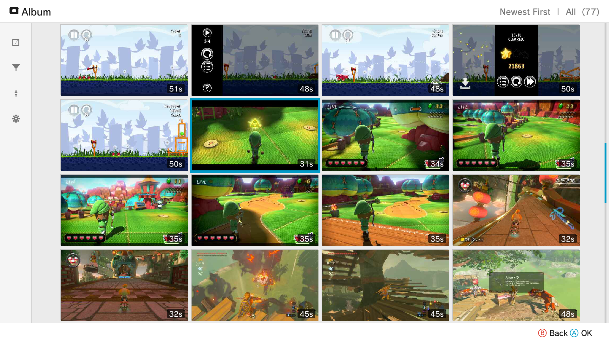

# Wii U Album

A media gallery for the Nintendo Wii U. Browse, view, edit, and wirelessly transfer your screenshots and videos to a smart device.



## Features

### Gallery View
- Finds screenshots and videos stored in : `/fs/vol/external01/wiiu/screenshots` [Screenshot plugin](https://github.com/wiiu-env/ScreenshotWUPS/) / `/fs/vol/external01/wiiu/videos` [ScreenCapture Plugin](https://github.com/Sudachi-E/ScreenCapturePlugin)
- Filter by media type, application name, sort by date (newest/oldest)

### Video Clipping
- Trim videos with visual timeline and preview

### Image Editor
- Add customizable text to screenshots (size, position, rotation and color)

### QR Code Transfer
- Scan QR code with any device to transfer media or enter the URL into a browser
- Supports single and multi-file transfers (up to 5 files)

## Supported Controllers

- Wii U GamePad
- Wii U Pro Controller
- Wiimote (with pointer support) 
- Classic Controller
- Nunchuk

## Requirements

### Build Environment
 devkitPro toolchain with `DEVKITPRO` environment variable set
  - [wut](https://github.com/devkitPro/wut)
  - [wiiu-sdl2](https://github.com/yawut/SDL)
  - [FFmpeg](https://github.com/GaryOderNichts/FFmpeg-wiiu)

## Building

```bash
make
```

The output `WiiUAlbum.wuhb` should be placed in `/wiiu/apps/` on the SD card

## Credits

[@fukuchi](https://github.com/fukuchi) for [libqrencode](https://github.com/fukuchi/libqrencode) - used for QR code